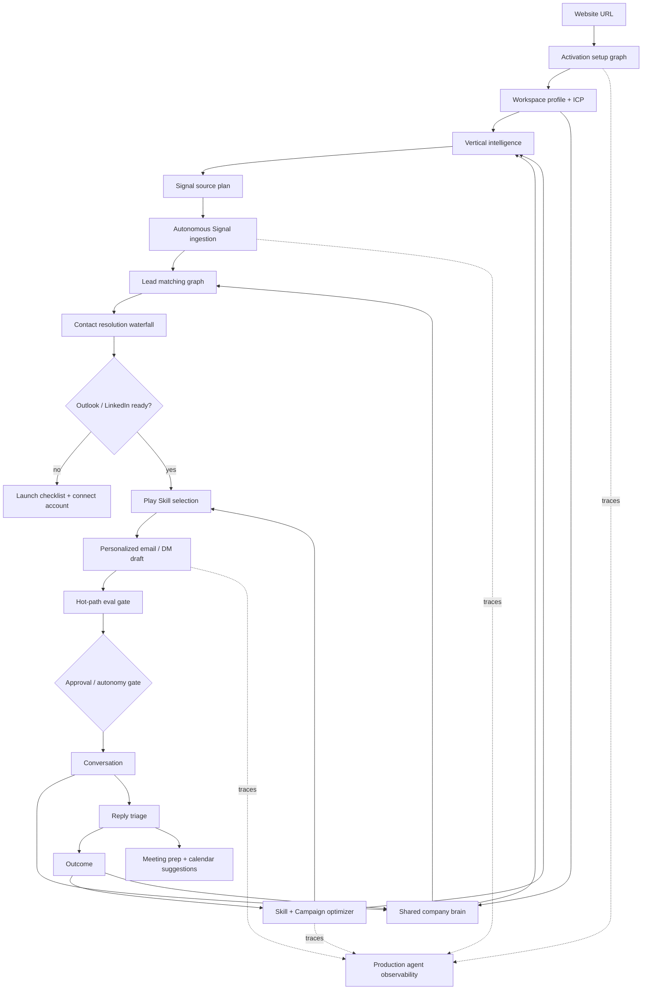

# feat: Build the AI-native GTM operator pivot

## Summary

This plan pivots Bombsell into a low-cost AI-native GTM operator for lean B2B teams:

1. A user enters a website URL.
2. Bombsell builds the workspace profile, ICP, vertical intelligence, Rep, Signal sources, and first Play plan.
3. Autonomous Signal ingestion finds timing evidence and matches leads against the profile and ICP.
4. Contact resolution runs a graph-first enrichment waterfall to find reachable people.
5. The user connects Outlook and LinkedIn accounts before outreach can start.
6. A shared company brain captures workspace knowledge from product work, email, LinkedIn, meetings, notes, and agent sessions so every Rep and graph can recall the same context with provenance.
7. Campaigns run Play Skills across email and LinkedIn, personalize every message, pass a hot-path judge, and optimize toward replies, meetings, and pipeline Outcomes.
8. Successful replies create intelligent meeting-prep notes by combining thread history, prospect profile, user profile, original Signal, conversation topic, and shared team memory.
9. Production observability traces every graph node, model call, tool call, memory read/write, eval, workflow step, channel action, and optimizer decision with a vendor-neutral schema.

LangGraph becomes the stateful agent runtime for each concrete feature step, but Restate remains the durable owner of long-running workflows, external side effects, waits, retries, approvals, and resume. The typed event bus, knowledge graph, five primitives, native channels, hot-path eval, trust traces, and agent parity from `ARCHITECTURE.md` remain mandatory.

The product borrows Monaco's product fluency and visual discipline, not its exact brand. Bombsell keeps the current `/logo.svg` and its colors unchanged, keeps the current Monaco-inspired Bombsell theme in `DESIGN.md` and `app/globals.css`, and uses Bricolage Grotesque, Geist, and Geist Mono as the frontend typography contract.

---

## Product Thesis

Bombsell should not be "a dashboard that helps you do outbound." It should be the operator that turns a company's vertical knowledge into qualified conversations:

- **Rep:** the visible AI operator for a workspace.
- **Signal:** timing evidence that explains why now.
- **Play:** a controlled strategy for who to contact, on which channel, with which skill, and under what gate.
- **Conversation:** the cross-channel thread and activity memory.
- **Outcome:** the proof loop that teaches the next Play what worked.

"Play Skills" are not a sixth user-facing primitive. They are internal procedural memory and reusable Play instructions: message frameworks, channel rules, personalization slots, eval bars, and outcome stats that live under Plays and Rep memory.

The shared company brain is also not a sixth primitive. It is the workspace-scoped memory and graph layer that lets people, Reps, Plays, Conversations, Outcomes, and external MCP clients recall the same source-backed context.

---

## External Product Read

### Monaco

Monaco's product page is a six-step revenue operating loop: Build TAM, Overlay signals, Execute sequences, Capture Activity, Track Pipeline, and Ask Monaco. The lesson for Bombsell is causal product fluency: market definition feeds signal priority, signal priority feeds execution, captured activity feeds pipeline judgment, and the copilot gives prioritized next actions.

Frontend read:

- Monaco uses a restrained dark product presentation with large product screenshots, numbered progression, dense UI proof, and very little decorative copy.
- Its current page assets reference Inter and Season Serif, with near-black surfaces like `#0f0f0f`, `#111113`, `#181818`, white and translucent white text, and tight product-led layouts.
- Bombsell should apply the style principles through Bombsell's own theme: dark canvas, warm amber action rail, cream text, product panes, numbered loops, and compact operational copy.

### GojiBerry

GojiBerry's public wedge is extremely close to the desired activation loop: enter a website, let the agent learn the business, find high-intent leads, score against ICP, run LinkedIn and email outreach, and improve weekly from campaign results. Bombsell should adopt the "website to GTM operator" simplicity while enforcing stronger architecture and trust.

### AI-Native GTM Market Pattern

Unify, Artisan, and Regie converge on the same durable product shape:

- TAM or target-account intelligence.
- Always-on Signals and intent monitoring.
- Contact data and enrichment.
- Personalized multichannel execution.
- Agent or campaign optimization.
- Meeting booking or activity capture.
- Clear analytics for what to double down on.

Instantly's 2026 cold email benchmark reinforces the operating metric: relevance beats volume, reply rate is the control metric, top performers test messaging continuously, and follow-ups still matter. Clay's waterfall docs reinforce the data pattern: run providers in a predetermined sequence, stop when enough coverage is achieved, and avoid duplicate spend.

### Memory Store

Memory Store's product lesson is that the company brain is not a chat feature. It is shared operational memory that turns ongoing work into reusable context for teammates and agents. Its public positioning emphasizes syncing sources like Gmail, Slack, Granola, Claude, Codex, Cursor, Linear, Raycast, Fathom, and agents; organizing memory by project, person, decision, and customer ask; and making that memory available anywhere through search, briefs, playbooks, and MCP.

The lesson for Bombsell is leverage, not dependency. Bombsell already has the right architecture for this through Rep memory, typed events, graph facts, primitive IDs, and MCP. The pivot should build a workspace-scoped shared company brain over those foundations, optionally integrating with Memory Store for customers that already use it, while keeping Bombsell's own graph/event journal as the source of truth for GTM context.

### Agent Observability Tools

The production observability market has converged around traces, evals, cost, and agent state:

- LangSmith is strongest when LangGraph and LangChain debugging are the center of gravity.
- Langfuse is an open-source, self-hostable AI engineering platform with traces, prompts, evals, OpenTelemetry support, and agent graph views.
- Arize Phoenix is open-source and OpenTelemetry/OpenInference-native, with tracing, retrieval/tool spans, and evaluations.
- Helicone is strongest as an AI gateway and cost/latency/caching observability layer.
- Braintrust is strongest when production traces need to become eval cases and CI release gates.

Bombsell should start with an internal OpenTelemetry/OpenInference-compatible span schema and event journal, then export to the lowest-cost tool that satisfies production needs. The default spike should compare Langfuse and Phoenix first for open/self-hostable observability, keep LangSmith as a LangGraph debugging option, use Helicone only if gateway cost/caching becomes valuable, and add Braintrust when trace-to-eval CI discipline is worth the spend.

---

## Current Implementation Fit

This plan does not keep current implementation because it exists. It keeps the parts that are already the right architecture for the new product, and replaces or extends the rest.

| Area | Decision | Why |
|---|---|---|
| Five primitives, typed events, Restate, NATS, graph, MCP, hot-path eval | Keep | This is the architecture required for an auditable AI-native GTM operator. |
| Outlook-first outbound | Keep and expand | The current `oauth_outlook` channel path matches the user's requirement to connect Outlook before outreach and can extend to calendar prep. |
| LinkedIn provider boundary | Keep and productionize | The current provider-auth, provider-webhook, fail-closed transport, and readiness checks are the right shape; the missing work is compliant production provider setup and launch gating. |
| `contact.resolve_for_signal.v1` | Keep and upgrade | It already implements graph cache, provider waterfall, verification, typed resolution events, and ranking. The plan makes it the official contact-resolution backbone. |
| Procedural memory and campaign learning | Keep and deepen | Current memory already compounds Outcomes into exemplars. It needs skill-level attribution, reply-rate optimization, and campaign exploration/double-down logic. |
| Shared company brain | Add as derived layer | Build it from Rep episodic/semantic/procedural memory, graph facts, Conversations, Outcomes, and source connectors. It is not a sixth primitive. |
| Agent observability | Add production contract | Keep internal typed traces as the source of truth, then export redacted spans to Langfuse, Phoenix, LangSmith, Helicone, or Braintrust after a cost/fit spike. |
| DeepSeek default model | Replace | Code currently defaults to `deepseek-v4-pro`; the pivot default must be `deepseek-v4-flash` for cost. V4 Pro is only an explicit escalation. |
| AWS/ECS/SES remnants | Avoid for new work | Existing docs already say do not reopen AWS for launch. New infra should prefer Vercel, Supabase/Postgres, Restate Cloud, NATS, and a low-cost non-AWS worker host. |
| Frontend theme | Keep current Bombsell theme | It already encodes the Monaco-inspired dark operating surface. Do not recolor or filter the current Bombsell logo. |
| Content/AEO product surfaces | Keep retired | The active product is prospecting, Signals, email/LinkedIn outreach, Campaigns, and meeting prep. |

---

## Requirements

### Website-to-Full-Setup Activation

- R1. A new workspace starts from a website URL and reaches a full setup draft: company profile, ICP, vertical intelligence, Rep, source plan, first Play proposals, and channel launch checklist.
- R2. The first setup path must not require a manual lead list. Lists can be imported later, but autonomous sourcing is the default.
- R3. Website setup must map every output to Rep, Signal, Play, Conversation, or Outcome.
- R4. The setup path must show what is confirmed, what is inferred, what evidence was used, what needs user approval, and what blocks launch.
- R5. The first Play proposals must be gated until Outlook and/or LinkedIn accounts are connected and healthy.

### Autonomous Signals and Lead Matching

- R6. Signal ingestion must run autonomously from configured sources with per-source budgets, provenance, freshness, and kill switches.
- R7. Lead matching must score companies and people against the workspace profile, ICP, vertical intelligence, similar customers, prior Outcomes, and current Signal evidence.
- R8. Signal rows and prospect views must explain "why this lead, why now, why this channel, and what proof supports it."
- R9. Matching must emit typed events and graph updates rather than direct route-level table writes.

### Contact Resolution and Enrichment Waterfall

- R10. Contact resolution must use the existing waterfall model as the official path: graph cache first, then provider discovery, then verification, then ranked candidate selection.
- R11. The waterfall must stop early when it has enough verified reachable contacts to avoid unnecessary provider spend.
- R12. Each provider step must record provider name, success/failure, confidence, cost metadata when available, and candidate provenance.
- R13. Email outreach requires verified or deliverable email status; LinkedIn outreach requires a valid LinkedIn profile and connected channel account.

### Channel Connections and Outreach Launch

- R14. Outlook connection is the default email launch path and must include send readiness, reply sync readiness, and later calendar readiness.
- R15. LinkedIn connection must go through a compliant user-consented provider boundary, fail closed when unconfigured, and enforce pacing, volume, account health, and provider incident gates.
- R16. A Campaign cannot start external outreach until the target channel account is connected, healthy, and allowed by the Play's autonomy policy.
- R17. Email and LinkedIn touches must be coordinated as one Conversation path, not siloed channel sequences.

### Personalized Messages and Play Skills

- R18. Every message must be personalized from the workspace profile, ICP, vertical intelligence, prospect/company graph, original Signal, contact role, prior thread, and channel context.
- R19. Play Skills must encode proven framework families for cold email and cold DM: trigger-led opener, problem-proof-CTA, PAS, AIDA, before-after-bridge, challenger insight, customer-lookalike proof, connection-note-to-DM, comment-to-DM, and polite breakup/follow-up.
- R20. "Proven" means externally grounded as a known framework family, but locally promoted only after Bombsell sees reply and Outcome data.
- R21. Every generated message must pass the existing hot-path judge before it can reach approval or send.
- R22. Sub-threshold drafts never reach a channel, even in autopilot mode.

### Campaign Strategy Optimization

- R23. Campaigns are Play portfolios that try multiple skills, channels, timing rules, and audience slices under explicit volume caps.
- R24. The optimizer must double down on variants that improve positive replies, meetings, opportunities, or deal Outcomes, and reduce variants that cause bounces, unsubscribes, do-not-contact Outcomes, low reply rates, or judge failures.
- R25. The optimizer must avoid false learning by requiring minimum sample sizes, confidence thresholds, and segment-aware comparisons.
- R26. The user must see what changed, what evidence caused it, and whether the change is recommended, approved, or already applied.

### Reply Handling, Calendar, and Meeting Prep

- R27. Successful replies must be classified into positive, neutral, objection, referral, meeting-intent, unsubscribe, do-not-contact, and out-of-office patterns.
- R28. Meeting-intent or positive replies should trigger a meeting-prep graph that produces a user-readable prep note.
- R29. Prep notes must combine message thread history, prospect and company graph, user profile, Rep memory, original Signal, conversation topic, objections, suggested agenda, likely pain, proof to bring, and next best action.
- R30. Calendar availability and meeting creation must use Outlook/Microsoft Graph with least-privilege scopes and explicit user consent. Auto-booking requires a Play gate; default is draft/suggest, not silent booking.

### LangGraph Stateful Agents

- R31. Every concrete feature or step in this plan must have a named LangGraph stateful agent graph.
- R32. LangGraph state must use primitive IDs, thread IDs, run IDs, correlation IDs, and event IDs so every node can be replayed and traced.
- R33. LangGraph tools must wrap the existing `core/agents/tools` registry, not create a parallel capability surface.
- R34. LangGraph interrupts must map to existing workflow approvals and event waits.
- R35. Restate remains the only durable owner for long-running workflows, sleeps, retries, external side effects, and production resume.

### Model and Cost Posture

- R36. `deepseek-v4-flash` is the default model for drafting, classification, light reasoning, judge calls, and optimizer loops.
- R37. `deepseek-v4-pro` can be used only for explicit escalation cases: hard multi-document synthesis, repeated V4-Flash failure, or operator-approved investigation.
- R38. Every LLM call must run through budget accounting, daily caps, prompt compaction, context caching where available, and evented usage records.
- R39. No new AWS services should be added. Use Vercel for the app, Supabase/Postgres for state, Restate Cloud for durable orchestration, NATS for dispatch, Cloudflare R2 or similar for object storage, and Render/Fly/Railway-style low-cost worker hosting if a Node container is needed.

### Frontend Theme and Product Style

- R40. The pivot UI must include Monaco's product style principles: dark product proof, numbered loops, large real product panes, compact operational copy, and visible activity capture.
- R41. The implementation uses Bombsell's current theme tokens: `#070806`, `#15130f`, `#1d1a13`, `#282319`, warm hairlines, cream text, amber action colors `#c9a35b` and `#f0c66a`, and semantic green/amber/red only for status.
- R42. The frontend must use Bricolage Grotesque for display, Geist for body/UI, and Geist Mono for labels and step counters.
- R43. The current Bombsell `/logo.svg` must be used without filters, masks, tinting, recoloring, or replacement. The logo's current colors stay intact.
- R44. Product screens should avoid generic SaaS cards and decorative gradients; use product panes, tables, rows, traces, proof chips, and narrow action rails.

### Trust, Parity, and Migration

- R45. Every user-visible action must have a registered tool or MCP-equivalent capability.
- R46. Every autonomous or approved action must leave a trust trace: Signal evidence, graph facts, memory used, skill selected, judge result, approval gate, channel result, and Outcome attribution.
- R47. Existing Restate workflow names, event types, primitive tables, MCP tools, and active navigation must remain compatible until a deliberate migration changes them.
- R48. Content and AEO stay outside the active surface for this pivot.

### Shared Company Brain

- R49. The company brain is a derived workspace memory layer over the five primitives, not a new user-facing primitive.
- R50. It must capture GTM-relevant knowledge from Outlook, LinkedIn, Conversations, Signals, Outcomes, user profile edits, campaign decisions, meeting notes, agent runs, and future connectors such as Slack, Granola, Fathom, Claude, Codex, Cursor, Linear, and Memory Store.
- R51. It must organize knowledge by company, person, project, decision, customer ask, Play, objection, proof point, process, and vertical.
- R52. It must produce living briefs: ICP brief, workspace brief, account brief, campaign brief, decision log, customer-ask log, objection/proof bank, and vertical playbook.
- R53. It must expose the same scoped memory to users, Reps, LangGraph graphs, product tools, and MCP clients.
- R54. Every memory must carry source refs, primitive refs, provenance, confidence, freshness, stale/contested flags, and deletion/retention policy.
- R55. Memory access must obey workspace/team/RBAC scope and redact PII where required.
- R56. Memory Store integration is optional and connector-based: read/write through MCP or approved APIs when a customer already uses it, without making Memory Store a hard platform dependency.

### Production Agent Observability

- R57. Every agent run must emit typed spans for `agent.run`, `langgraph.node`, `llm.call`, `tool.call`, `memory.read`, `memory.write`, `eval.judge`, `workflow.step`, `channel.send`, `contact.waterfall.step`, `approval.interrupt`, and `campaign.optimizer.decision`.
- R58. Trace attributes must be OpenTelemetry/OpenInference-compatible and include workspace ID, primitive IDs, graph name, node name, run ID, thread ID, correlation ID, causation event ID, model, token/cost metadata, latency, retry count, status, and redaction status.
- R59. The internal event journal and trace table are the source of truth; external observability export must be configurable and redacted by default.
- R60. Production dashboards must track latency, cost, token usage, retries, provider errors, judge failures, send deferrals, channel-health failures, waterfall spend, memory retrieval freshness, and optimizer decisions.
- R61. Production failures must feed a trace-to-eval loop that turns failed drafts, bad tool plans, wrong memories, and channel mistakes into regression eval cases.
- R62. Release gates must block untraced graph nodes, unbudgeted LLM calls, unjudged sends, raw-PII trace exports, and direct state writes from graph nodes.
- R63. The tool spike must compare Langfuse, Arize Phoenix, LangSmith, Helicone, and Braintrust by cost, self-hosting, OpenTelemetry/OpenInference support, LangGraph support, TypeScript support, eval workflow, and PII controls.
- R64. The initial production default should be internal spans plus Langfuse or Phoenix in staging; LangSmith, Helicone, and Braintrust are added only when their specific strengths justify cost and complexity.

---

## Key Technical Decisions

- KTD1. **The product is a GTM operator, not a CRM clone.** Build enough TAM, activity capture, and meeting prep to run the outbound loop; do not expand into generic CRM maintenance unless it supports Signals, Plays, Conversations, or Outcomes.
- KTD2. **Play Skills are procedural memory.** They are internal Play instructions and Rep memory, not a new primitive or top-level product noun.
- KTD3. **LangGraph is the stateful agent step runtime.** LangGraph owns node routing, state, tool calls, evaluator-optimizer loops, and human interrupts inside a workflow step. Restate owns durable workflow execution.
- KTD4. **DeepSeek-V4-Flash is the default economics layer.** V4 Flash's official 1M context, tool-call support, and low price make it the default model for broad agent loops.
- KTD5. **The contact waterfall is graph-first and spend-aware.** Existing graph data wins. Paid providers run only when graph cache is insufficient.
- KTD6. **Outlook and LinkedIn are launch gates.** No external send path bypasses channel account health, reply sync/provider health, Play autonomy, and hot-path eval.
- KTD7. **Campaign optimization uses conservative bandits.** Start with small exploration, compare variants by segment and channel, then shift volume only after enough evidence.
- KTD8. **Meeting prep is a Conversation-derived workflow.** The output is a derived view over Conversation, Signal, Rep memory, Prospect graph, and Outcome, not a new primitive.
- KTD9. **Vertical intelligence lives in the graph and memory.** Industry facts, ICP rules, objections, proof, and successful patterns should be queryable by Reps and reusable by Skills.
- KTD10. **Monaco-inspired design is a style contract, not a brand copy.** Keep Bombsell's logo, color identity, and typography while borrowing the product-led dark operating surface.
- KTD11. **The shared company brain is derived, not primitive.** It is the workspace-scoped memory and graph layer that makes Reps, Plays, Conversations, Outcomes, and users recall the same decisions, customer asks, objections, and proofs.
- KTD12. **Observability is schema-first.** Start with OpenTelemetry/OpenInference-compatible spans in Bombsell's event journal, then export redacted traces to Langfuse or Phoenix first, with LangSmith, Helicone, or Braintrust added for specific production gaps.

---

## High-Level Product Loop

---

## LangGraph Stateful Agent Map

Every graph below is a LangGraph graph version called by a Restate workflow or product tool. Each graph state must include `workspace_id`, `rep_id` where applicable, primitive IDs, `thread_id`, `run_id`, `correlation_id`, and `causation_event_id`.

| Graph | Concrete feature step | Trigger | Required state | Tool surface | Output / events |
|---|---|---|---|---|---|
| `activation.setup_graph.v1` | Website URL to setup draft | `workspace.activation.requested` | URL, workspace, user, existing profile | Web/profile tools, graph tools | `workspace.profile.drafted`, setup checklist |
| `profile.icp_graph.v1` | Profile and ICP extraction | Activation setup | website evidence, inferred personas, existing customers | `product.company.website_profile.extract`, graph writes through tools | `workspace.profile.drafted`, `icp.drafted` |
| `vertical.intelligence_graph.v1` | Vertical knowledge pack | Profile confirmed or Outcome learning | vertical, ICP, offer, Outcomes, objections | Exa/search, graph, memory | `vertical.intelligence.updated` |
| `source.discovery_graph.v1` | Signal source recommendation | Profile/ICP ready | ICP, vertical pack, budget caps | source config tools | `signal.source.recommended`, `product.source.configure` |
| `signal.ingestion_graph.v1` | Autonomous Signal discovery | source poll/webhook | source config, cursors, budget | ingest adapters, novelty tools, graph | `signal.discovered`, `signal.ingested` |
| `lead.matching_graph.v1` | Lead and account matching | Signal detected | Signal, profile, ICP, vertical facts, prior Outcomes | graph query, memory retrieval | `lead.matched`, ranked reasons |
| `contact.waterfall_graph.v1` | Reachable contact resolution | matched lead before Play | company/person refs, channel, provider order | `contact.resolve_for_signal.v1` wrapper | `contact.resolved` or `contact.resolution.deferred` |
| `channel.readiness_graph.v1` | Outreach launch gate | Play start or setup checklist | channel accounts, health, limits, provider status | Outlook, LinkedIn, readiness tools | `channel.ready`, `channel.defer` |
| `outreach.skill_selection_graph.v1` | Pick Play Skill | contact resolved | channel, persona, signal, campaign goals | procedural memory, skill registry | `play.skill.selected` |
| `message.personalization_graph.v1` | Draft email/DM | Skill selected | evidence, thread, profile, contact, skill | writer tools, memory, graph | draft provenance, `message.personalized` |
| `eval.gate_graph.v1` | Judge draft | draft created | draft, evidence, skill bar, channel constraints | `core/agents/eval` | `draft.judged`, `draft.rejected` |
| `campaign.strategy_graph.v1` | Variant allocation | Campaign launch/weekly optimizer | skills, outcomes, reply rates, budgets | campaign learning, memory | `campaign.variant.assigned`, recommendations |
| `reply.triage_graph.v1` | Classify replies and next action | Outlook/LinkedIn inbound event | thread, inbound message, prospect graph | classifier, memory, outcome tools | `reply.classified`, `outcome.recorded` |
| `calendar.prep_graph.v1` | Meeting prep note | positive or meeting-intent reply | thread, prospect, user, Signal, topic, calendar state | Outlook calendar, graph, memory | `meeting.prep.generated`, optional calendar draft |
| `skill.optimizer_graph.v1` | Outcome-driven skill update | weekly or threshold met | skill stats, replies, Outcomes, judge failures | procedural memory, campaign learning | `rep.memory.procedural.updated`, Play edit recommendation |
| `company_brain.ingest_graph.v1` | Promote work into shared memory | source event, user edit, meeting note, agent run, Outcome | source refs, primitive refs, candidate memories | graph, memory, redaction tools | `company.memory.ingested`, `company.memory.promoted` |
| `company_brain.recall_graph.v1` | Retrieve scoped workspace context | graph node, user query, MCP request | task, primitive refs, user scope, freshness needs | graph query, vector/full-text search, memory | `company.memory.recalled`, compact context pack |
| `company_brain.brief_graph.v1` | Maintain living briefs and logs | new memory, scheduled refresh, user request | memory refs, brief type, source window | graph, memory, summary tools | `company.brief.updated` |
| `observability.trace_graph.v1` | Normalize and export production traces | span recorded, trace completed, failure event | spans, redaction policy, export config | trace store, OTel exporter, eval case writer | `agent.trace.span.recorded`, `agent.trace.exported`, `agent.trace.eval_failed` |
| `trust.trace_graph.v1` | User-readable proof trace | Conversation or Campaign read | event chain, graph refs, memory refs | trace readers | product trace view |

Implementation note: `profile.icp_graph.v1` is now available as
`workspace.profile.icp`, wrapping `product.profile_icp.draft` so website evidence
can emit `workspace.profile.drafted` and `icp.drafted` before confirmed setup
writes Reps, Plays, sources, or channels. `signal.ingestion_graph.v1` is now
available as `workspace.signal.ingestion`, wrapping `product.sources.poll.start`
so autonomous ingestion starts due `ingest_workspace_poll` runs without lead
matching or outreach side effects. `message.personalization_graph.v1` is now
available as `workspace.message.personalization` and the existing Signal email/
LinkedIn Plays also emit `message.personalized` before `draft.proposed`, keeping
personalization provenance separate from eval/send decisions.
`eval.gate_graph.v1` is now available as `workspace.eval.gate`, wrapping
`product.draft.eval.gate` so the hot-path judge emits `draft.judged` /
`draft.rejected` without sending outreach.
`reply.triage_graph.v1` is now
available as `workspace.reply.triage`, wrapping the existing Conversation matcher,
Rep replier role, `reply.classified`, and reply Outcome path.
`skill.optimizer_graph.v1` is now available as `workspace.skill.optimizer`,
wrapping `product.play.skills.optimize` so Campaigns can combine attributable
Outcomes and procedural-memory wins/losses into gated Play Skill
recommendations without directly mutating Plays.

---

## Data and Event Contracts

Add or extend typed events only through the registry. Do not let route handlers or graph nodes write durable state directly.

| Event | Purpose |
|---|---|
| `workspace.activation.requested` | Starts website-to-full-setup. |
| `workspace.profile.drafted` | Stores inferred profile and evidence before confirmation. |
| `icp.drafted` | Stores inferred ICP/persona/segment rules before confirmation. |
| `vertical.intelligence.updated` | Updates graph-backed vertical facts, objections, proof, and positioning. |
| `signal.source.recommended` | Records recommended source adapters and expected budget. |
| `lead.matched` | Records Signal-to-company/person matching reasons. |
| `contact.waterfall.step_completed` | Records provider step status, count, cost metadata, and provenance. |
| `contact.resolved` | Existing event; official selected contact and candidates. |
| `contact.resolution.deferred` | Existing event; no reachable contact or channel-specific block. |
| `play.skill.selected` | Records selected skill version, framework, and reason. |
| `message.personalized` | Records draft provenance before judge. |
| `draft.judged` | Existing hot-path judge event. Must always precede send. |
| `campaign.variant.assigned` | Records campaign experiment assignment. |
| `reply.classified` | Records reply intent and confidence. |
| `meeting.prep.generated` | Records prep-note refs, agenda, risks, and calendar suggestions. |
| `rep.memory.procedural.updated` | Existing memory update event, extended with skill attribution. |
| `company.memory.ingested` | Records candidate workspace memory with source refs before promotion. |
| `company.memory.promoted` | Records approved or confidence-qualified memory available to Reps and product tools. |
| `company.memory.recalled` | Records scoped memory retrieval with refs, freshness, and redaction status. |
| `company.brief.updated` | Records generated or refreshed workspace, ICP, account, campaign, decision, ask, objection, proof, or vertical brief. |
| `agent.trace.span.recorded` | Records a normalized production span for agent, graph, tool, model, memory, eval, workflow, channel, contact, approval, or optimizer activity. |
| `agent.trace.exported` | Records a redacted external export batch and destination. |
| `agent.trace.eval_failed` | Records a production trace promoted into a regression eval case. |

---

## Outreach Skill System

### Skill Shape

Play Skills live as versioned procedural memory and typed configuration, not as user-facing primitives.

Required fields:

- `skill_id`, `version`, `play_id`, `rep_id`, `workspace_id`.
- `channel`: `email`, `linkedin_connection`, `linkedin_dm`, `linkedin_comment`, or a coordinated sequence of those.
- `framework`: one of the approved framework families.
- `fit`: ICP, persona, vertical, Signal kind, stage, company size, and relationship context.
- `template_slots`: opener, proof, pain, ask, CTA, follow-up, fallback, and stop condition.
- `evidence_requirements`: minimum graph facts, source URLs, Signal freshness, and contact confidence.
- `eval_bar`: judge criteria and fail-closed conditions.
- `volume_rules`: daily cap, spacing, channel-specific pacing, and approval mode.
- `stats`: sends, positive replies, reply rate, meeting rate, bounce/unsubscribe/do-not-contact rates, judge failures, and confidence.

### Framework Families

Cold email skill families:

- Trigger-led opener: "I saw X, which usually means Y."
- Problem-proof-CTA: problem, relevant proof, one low-friction ask.
- PAS: problem, agitate, solve.
- AIDA: attention, interest, desire, action.
- Before-after-bridge: current state, better state, bridge.
- Challenger insight: concise market insight with a specific implication.
- Customer-lookalike proof: similar customer/situation, result, reason to talk.
- Founder/operator direct: short context, clear relevance, direct ask.

LinkedIn/cold DM skill families:

- Connection note with a real Signal reason.
- Comment or engagement to DM path.
- Profile-view/follower/topic opener.
- Mutual-context or community opener.
- Competitor/topic timing opener.
- Post-acceptance short DM.
- Polite follow-up and breakup.

Promotion rule:

- External frameworks can seed the library.
- Local Outcomes decide what becomes a winning skill.
- Skill promotion requires enough samples, segment fit, positive reply lift, low negative Outcomes, and no judge-quality regression.

---

## Campaign Strategy Optimization

Campaigns become controlled Play portfolios. The Campaign surface should show which skills are being tried, where volume is going, and what the system has learned.

Optimization approach:

- Start with small exploration across skill, channel, timing, and audience variants.
- Use a conservative bandit or Bayesian score per segment, with hard safety caps.
- Optimize by weighted Outcomes:
  - `meeting_booked`, `opportunity_created`, `deal_won` are strongest wins.
  - `positive_reply` is an early win.
  - neutral replies and referrals can preserve or lightly lift a variant.
  - bounces, unsubscribes, do-not-contact, low judge scores, and channel defers penalize variants.
- Compare like with like: vertical, persona, company size, Signal kind, channel, and cold/warm relationship state.
- Double down only after minimum samples and confidence thresholds.
- Expose recommendations before autonomous changes unless the Play gate explicitly allows automatic optimization.

---

## Contact Resolution and Enrichment Waterfall

The existing `core/contacts/resolution.ts` workflow is the right foundation. It should become the product's formal waterfall:

1. **Graph cache:** existing `graph_persons` rows with email or LinkedIn profile.
2. **Low-cost public evidence:** website, Exa, graph-adjacent public profile/company evidence.
3. **Contact providers:** Apollo, FullEnrich, Hunter, Crustdata/person APIs, or configured equivalents.
4. **Verification:** ZeroBounce, Hunter verification, or configured verifier.
5. **LinkedIn readiness:** valid profile URL plus connected LinkedIn account.
6. **Manual/user fallback:** ask for a contact or allow the user to import a list only after autonomous resolution fails.

Waterfall rules:

- Stop when the top candidate is channel-ready and above confidence threshold.
- Record provider order, attempts, failures, cost metadata, and selected candidate in typed events.
- Prefer existing verified graph data over paid calls.
- Never send to unverified or risky email status.
- Never use scraped LinkedIn sessions outside the approved provider/account-consent boundary.

---

## Channel Connection and Meeting Prep

### Outlook

Keep Outlook/Microsoft Graph as the launch-critical email channel:

- Existing connect URL: `product.outlook_account.connect_url.get`.
- Existing account kind: `oauth_outlook`.
- Existing send path: Microsoft Graph `sendMail`.
- Existing reply sync path: Outlook subscriptions and `/api/webhooks/outlook`.

Extend for calendar:

- Add explicit calendar consent when meeting prep is enabled.
- Use Microsoft Graph calendar APIs for free/busy, suggested meeting times, and event creation.
- Default to prep note and suggested times. Auto-create or auto-send calendar invites only if the Play gate allows it.

### LinkedIn

Keep the provider boundary:

- Existing connect URL: `product.linkedin_account.connect_url.get`.
- Existing env contract: `LINKEDIN_PROVIDER_URL`, `LINKEDIN_PROVIDER_AUTH_URL`, `LINKEDIN_PROVIDER_HEALTH_URL`, `LINKEDIN_PROVIDER_API_KEY`, `LINKEDIN_PROVIDER_WEBHOOK_SECRET`.
- Existing fail-closed behavior in production stays mandatory.

Required before launch:

- Real provider configured and healthy.
- Signed lifecycle webhooks.
- Account status visible in readiness and trust trace.
- Human-like pacing, per-Play/channel volume caps, and quality filters.

### Meeting Prep Notes

Trigger:

- Positive reply, meeting-intent reply, or user-marked successful reply.

Inputs:

- Full Conversation thread across Outlook and LinkedIn.
- Prospect person/company graph.
- User/workspace profile, offer, ICP, and vertical intelligence.
- Original Signal and topic.
- Rep semantic and procedural memory.
- Calendar availability if connected.

Output:

- Why they likely replied.
- What they care about.
- Suggested agenda.
- Likely objections and how to handle them.
- Proof or customer examples to bring.
- Suggested meeting times or calendar draft.
- Next best reply, gated by approval.

---

## Knowledge Graph and Vertical Intelligence

Vertical intelligence is an internal graph-backed layer that makes the product feel expert in a chosen market without adding a new primitive.

It should store:

- ICP firmographics and persona rules.
- Offer, pain, objection, proof, competitor, and trigger taxonomy.
- Signal-to-pain mappings.
- Company/person facts and provenance.
- Skill performance by vertical, persona, Signal kind, and channel.
- Meeting prep patterns and successful objection handling.

Implementation principles:

- Extend graph nodes/edges and Rep memory before adding ad hoc tables.
- Every fact needs provenance, confidence, and last-observed time.
- Every prompt should receive compact vertical context, not raw dumps.
- Outcome learning should update vertical intelligence only after confidence thresholds are met.

---

## Shared Company Brain

Memory Store's strongest idea is that company memory should be created while work happens, organized before the next prompt, and recalled wherever humans and agents need it. Bombsell should apply that pattern to GTM context while staying native to `ARCHITECTURE.md`.

### Product Shape

The company brain is a derived view over primitive-linked memory:

- **Rep memory:** episodic interactions, semantic facts, procedural Play Skills, and learned patterns.
- **Signal memory:** timing evidence, source provenance, freshness, and why-now context.
- **Play memory:** selected skills, message variants, gates, approvals, and optimizer decisions.
- **Conversation memory:** Outlook/LinkedIn threads, replies, objections, referrals, prep notes, and next actions.
- **Outcome memory:** reply quality, meetings, opportunities, wins, losses, unsubscribes, do-not-contact events, and learning deltas.

It should feel like a shared company brain in the UI, but internally it stays a graph/memory layer scoped by workspace, team, user, and primitive refs.

### Sources

Launch sources:

- Website activation, profile edits, ICP edits, and vertical intelligence.
- Outlook sent mail, replies, thread classifications, and calendar prep with explicit consent.
- LinkedIn connection/DM activity through the approved provider boundary.
- Signals, contact waterfall results, Campaign decisions, and Outcomes.
- User corrections, approvals, rejections, and notes.
- Agent traces where the trace has durable product value, such as a decision, learned objection, or failed skill.

Future connectors:

- Slack, Granola, Fathom, Linear, Claude, Codex, Cursor, and Memory Store through connector/MCP boundaries.
- Memory Store can be a high-value import/export target for teams already using it, especially for decision logs, customer asks, and project briefs, but Bombsell should not require it for core operation.

### Product Leverage

- **Activation:** pull company voice, ICP hints, customer asks, and previous decisions into the website-to-setup graph.
- **Signal matching:** recall vertical proof, known competitors, customer patterns, and "we do not sell to" constraints.
- **Outreach:** feed writers with compact, source-backed proof, objections, tone, and examples.
- **Campaign optimization:** connect reply performance to the campaign brief and Play Skill history.
- **Meeting prep:** combine the current thread with team knowledge, prior customer asks, decision history, and relevant proof.
- **Agent handoff:** every LangGraph graph reads the same workspace memory so work does not reset between agents.
- **MCP:** expose scoped memory search, brief fetch, and memory correction tools to external agent surfaces.

### Governance

- Every memory has source refs, primitive refs, confidence, freshness, owner/scope, redaction status, and deletion policy.
- Promotion from candidate memory to shared memory requires either user approval or confidence-qualified event rules.
- Stale, contested, or user-corrected memories should be visible and excluded from hot-path prompts unless explicitly allowed.
- Raw private thread content should not be exported to external observability or memory tools unless the workspace config allows it.

---

## Production Agent Observability

The autonomous product cannot be trusted if its agents are opaque. Observability should be designed as a production control plane, not a debugging afterthought.

### Minimum Span Schema

Every span should include:

- `workspace_id`, `rep_id`, primitive IDs, graph name, node name, run ID, thread ID, correlation ID, causation event ID, and parent span ID.
- Span kind: `agent.run`, `langgraph.node`, `llm.call`, `tool.call`, `memory.read`, `memory.write`, `eval.judge`, `workflow.step`, `channel.send`, `contact.waterfall.step`, `approval.interrupt`, or `campaign.optimizer.decision`.
- Model/provider, prompt version, skill version, tool name, event name, retry count, latency, token usage, estimated cost, status, error class, and redaction status.
- Safety fields: approval mode, judge score, PII classification, channel readiness, send decision, memory freshness, and export destination.

### Tooling Recommendation

Start schema-first and low-cost:

1. **Day 1:** write spans to Bombsell's event journal/Postgres with OpenTelemetry/OpenInference-compatible attributes and product trace views.
2. **Week 1:** export redacted spans in staging to Langfuse and Phoenix, then pick the lower-friction default for production.
3. **Week 2:** compare LangSmith only for LangGraph-specific debugging pain, not as a required production dependency.
4. **Month 1:** add Helicone only if gateway routing, caching, provider fallback, or cost alerts are worth the extra path.
5. **Month 1+:** add Braintrust when trace-to-eval and CI release gates need a dedicated workflow beyond internal tests.

Default recommendation: internal spans plus Langfuse or Phoenix first. Keep the export adapter modular so a paying customer can bring LangSmith, Braintrust, or another OpenTelemetry destination later.

### Production Metrics

Track and alert on:

- p50/p95 latency by graph, node, provider, and channel.
- LLM token usage and spend by workspace, Play, Campaign, graph, and model.
- Judge failure rate, draft rejection reasons, and sub-threshold drafts blocked.
- Contact waterfall provider spend, hit rate, failure rate, and early-stop savings.
- Channel defers, provider incidents, rate-limit pressure, bounce/unsubscribe/do-not-contact rates.
- Memory retrieval freshness, contested-memory usage, and no-memory fallback rate.
- Optimizer decisions, sample sizes, confidence, and rollback events.
- Production trace failures promoted to eval cases and whether CI blocks regressions.

### Privacy and Export

- Redact raw message bodies and PII by default in external tools.
- Store source refs internally so authorized users can inspect the original context in Bombsell.
- Keep external exports destination-scoped, workspace-scoped, and revocable.
- Production release gates should fail on raw-PII export, missing span coverage, untraced sends, and unbudgeted model calls.

---

## Frontend Theme Contract

### Monaco Observed Style

| Element | Monaco read | Bombsell application |
|---|---|---|
| Product story | TAM -> Signals -> Sequences -> Activity -> Pipeline -> Ask | Website -> Profile/ICP -> Signals -> Matching -> Plays -> Conversations -> Outcomes -> Meeting prep |
| Palette | Near-black surfaces, white/gray text, restrained contrast | Bombsell dark tokens: `#070806`, `#15130f`, `#1d1a13`, `#282319`, cream text, amber action |
| Fonts | Inter plus Season Serif references | Bricolage Grotesque display, Geist UI/body, Geist Mono labels |
| Layout | Numbered sections with real product screenshots | Numbered loops with real product panes and trust traces |
| Copy | Short, operational, outcome-led | Short, operational, primitive-aligned |

### Bombsell Tokens

| Token | Value | Usage |
|---|---|---|
| Canvas | `#070806` | Page background and product operating surface. |
| Page / panel | `#15130f`, `#1d1a13`, `#282319` | Panes, rows, side panels, proof surfaces. |
| Hairlines | `#f7ddb814`, `#f7ddb82b`, `#d6b36566` | Warm borders and dividers. |
| Text | `#f5ead7`, `#c8bea7`, `#918774`, `#635947` | Primary, secondary, subtle, faint. |
| Action accent | `#c9a35b`, `#f0c66a`, `#2a2114` | Active nav, primary action, focus, chips, step icons. |
| Status | `#67d19a`, `#f0c66a`, `#ff8b78` | Positive, warning, negative. |
| Display font | `Bricolage Grotesque, Geist, ui-sans-serif, system-ui` | Headlines and proof headings. |
| UI font | `Geist, ui-sans-serif, system-ui` | Body, nav, buttons, tables, controls. |
| Label font | `Geist Mono, ui-monospace, SFMono-Regular, Menlo, monospace` | Metadata labels, counters, traces. |
| Shape | `8px`, `10px`, `12px` | Buttons, rows, chips, repeated panes. |

### Logo Guardrail

- Use `public/logo.svg` through `/logo.svg`.
- Do not alter the SVG, replace it, apply CSS filters, mask it, recolor it, or override fills.
- Protect current logo colors, including `#23555C` and `#FCFCFD`.
- Product-surface tests should assert logo `src="/logo.svg"` and computed `filter: none` for rendered logo images.

---

## Implementation Units

### U1. Product Doctrine and Architecture Contract

- **Goal:** Record the new product shape as the website-to-GTM-operator pivot without adding user-facing primitives.
- **Requirements:** R1-R5, R45-R56.
- **Dependencies:** None.
- **Files:** `PRODUCT.md`, `ARCHITECTURE.md`, `DESIGN.md`, `docs/product-focus-prospecting-outbound-2026-06-12.md`, `docs/agent-native-capability-map.md`.
- **Approach:** Define the core loop, active surfaces, Play Skill semantics, vertical intelligence semantics, and non-AWS/model posture. Update only architecture sections whose contracts change.
- **Tests:** Documentation review and static checks for product-surface vocabulary if existing tests support it.
- **Verification:** A reviewer can trace every promise to Rep, Signal, Play, Conversation, or Outcome.

### U2. DeepSeek-V4-Flash Cost and Model Policy

- **Goal:** Make `deepseek-v4-flash` the default model for all AI calls while preserving explicit escalation to V4 Pro.
- **Requirements:** R36-R39.
- **Dependencies:** U1.
- **Files:** `core/agents/llm/deepseek.ts`, `core/agents/llm/types.ts`, `core/agents/llm/budget.ts`, `core/product/env.ts`, `core/agents/eval/adapters/deepseek-judge.ts`, `test/deepseek-model-policy.test.ts`.
- **Approach:** Change the default model to `deepseek-v4-flash`, add purpose-level model policy, require budgeted LLM calls, emit usage/deferred events, and document when V4 Pro can be used.
- **Tests:** Defaults to Flash when `DEEPSEEK_MODEL` is unset; V4 Pro requires explicit policy; budget cap defers calls and records `llm.call.deferred`.
- **Verification:** No unbudgeted model call path exists for new LangGraph agents.

### U3. LangGraph Runtime Adapter

- **Goal:** Add a LangGraph integration layer that runs stateful agent graphs inside durable Restate workflows.
- **Requirements:** R31-R35, R45-R47.
- **Dependencies:** U1, U2.
- **Files:** `package.json`, `package-lock.json`, `core/agents/langgraph/index.ts`, `core/agents/langgraph/state.ts`, `core/agents/langgraph/runtime.ts`, `core/agents/langgraph/tools.ts`, `core/agents/langgraph/checkpoint.ts`, `test/langgraph-runtime-adapter.test.ts`.
- **Approach:** Install official LangGraph TypeScript packages, define primitive-ID state schemas, adapt existing product tools into LangGraph ToolNodes, persist graph state through workflow correlation, and map interrupts to workflow approvals.
- **Tests:** Tool parity, checkpoint resume, approval interrupt mapping, no direct table write helper available to graph nodes.
- **Verification:** A minimal graph runs from a local workflow runtime and emits traceable events.

### U4. Website-to-Full-Setup Activation

- **Goal:** Convert a website URL into profile, ICP, Rep, source plan, first Plays, and launch checklist.
- **Requirements:** R1-R5, R31-R35, R40-R44.
- **Dependencies:** U2, U3.
- **Files:** `app/page.tsx`, `components/UrlStart.tsx`, `app/onboarding/actions.ts`, `app/onboarding/page.tsx`, `core/product/company-profile.ts`, `core/product/tools.ts`, `core/agents/langgraph/graphs/activation.ts`, `test/onboarding-activation.test.ts`.
- **Approach:** Emit `workspace.activation.requested`, run the activation graph, store draft facts through typed tools/events, show a compact setup checklist, and block launch on channel readiness.
- **Tests:** Website-only setup creates drafts but sends nothing; missing Outlook/LinkedIn parks launch; confirmed setup emits typed events.
- **Verification:** A fresh workspace can reach a gated ready-to-launch state without list upload.

### U5. Vertical Intelligence and Knowledge Graph

- **Goal:** Build vertical context that informs Signal matching, skills, messages, and meeting prep.
- **Requirements:** R6-R9, R18-R20, R29, R31-R35.
- **Dependencies:** U3, U4.
- **Files:** `core/graph/*`, `core/agents/memory/*`, `core/product/context.ts`, `core/agents/langgraph/graphs/vertical-intelligence.ts`, `db/migrations/*`, `test/vertical-intelligence.test.ts`.
- **Approach:** Extend graph and memory with provenance-backed vertical facts, pain/objection/proof taxonomy, Signal mappings, and skill performance stats. Keep prompt context compact.
- **Tests:** Graph facts include provenance/confidence; vertical context is available to writer and judge; low-confidence facts do not enter hot-path prompts.
- **Verification:** A draft can cite vertical evidence without raw source dumping.

### U6. Autonomous Signal Ingestion and Lead Matching

- **Goal:** Make autonomous Signal discovery and lead matching the default operating loop.
- **Requirements:** R6-R9, R31-R35.
- **Dependencies:** U5.
- **Files:** `core/ingest/catalog.ts`, `core/ingest/workspace-poll.ts`, `core/ingest/icp-filter.ts`, `core/product/qualified-signals.ts`, `core/agents/langgraph/graphs/signal-ingestion.ts`, `core/agents/langgraph/graphs/lead-matching.ts`, `app/dashboard/signals/page.tsx`, `app/dashboard/prospecting/page.tsx`, `test/signal-lead-matching.test.ts`.
- **Approach:** Rank Signals by ICP fit, vertical fit, freshness, novelty, reachability, prior Outcome memory, and channel readiness. Emit lead match events with reasons.
- **Tests:** Fresh high-intent Signals outrank stale ones; no reachable contact triggers waterfall; prior negative Outcomes reduce ranking; reasons are user-readable.
- **Verification:** Signal and Prospecting surfaces explain "why this lead now."

### U7. Contact Resolution and Enrichment Waterfall

- **Goal:** Upgrade `contact.resolve_for_signal.v1` into the official spend-aware contact waterfall.
- **Requirements:** R10-R13, R31-R35.
- **Dependencies:** U6.
- **Files:** `core/contacts/resolution.ts`, `core/contacts/providers/*`, `core/substrate/events/registry.ts`, `scripts/verify-outreach-pipeline.ts`, `test/contact-resolution-waterfall.test.ts`.
- **Approach:** Add step-level events, cost metadata, early-stop thresholds, provider adapters, verification policy, and ranking improvements. Keep the graph cache and current event names compatible.
- **Tests:** Graph cache avoids provider calls; failed provider does not fail the workflow; verified email is preferred; LinkedIn channel requires profile URL; deferred result blocks sends.
- **Verification:** The outreach pipeline proves signal-to-contact-to-draft path with provider provenance.

### U8. Outlook and LinkedIn Connection Readiness

- **Goal:** Make channel connection a first-class launch gate for outreach.
- **Requirements:** R14-R17, R30, R45-R47.
- **Dependencies:** U4, U7.
- **Files:** `app/api/auth/outlook/*`, `app/api/auth/linkedin/*`, `core/channels/email/*`, `core/channels/linkedin/*`, `core/product/qualified-signals.ts`, `core/product/tools.ts`, `scripts/verify-outlook-readiness.ts`, `scripts/verify-production-app.ts`, `test/channel-readiness.test.ts`.
- **Approach:** Preserve existing Outlook and LinkedIn connect tools, add a unified channel-readiness graph, expose readiness in setup/Campaigns, and fail closed for provider/account errors.
- **Tests:** Unauthenticated connect routes return `401`; missing LinkedIn provider blocks real sends; Outlook without active reply sync blocks autopilot; channel health appears in trust traces.
- **Verification:** A Campaign cannot send until channel readiness is true and visible.

### U9. Play Skill Library and Message Personalization

- **Goal:** Implement skill-driven personalized messages for email and LinkedIn.
- **Requirements:** R18-R22, R31-R35.
- **Dependencies:** U5, U7, U8.
- **Files:** `core/plays/skills/*`, `core/agents/reps/roles/writer.ts`, `core/agents/reps/roles/linkedin.ts`, `core/agents/eval/*`, `core/agents/langgraph/graphs/outreach-skill-selection.ts`, `core/agents/langgraph/graphs/message-personalization.ts`, `test/play-skills-personalization.test.ts`.
- **Approach:** Create a versioned skill registry backed by procedural memory, select skills by ICP/Signal/channel, draft with evidence and slot constraints, and pass the same evidence to the judge.
- **Tests:** Draft contains specific Signal evidence; framework slots are filled; judge sees writer context; failed judge returns no send decision; exemplar IDs carry into provenance.
- **Verification:** Conversation trust trace shows selected skill, evidence, judge result, and approval gate.

### U10. Campaign Skill Optimizer

- **Goal:** Let Campaigns try strategies and double down on what improves reply and Outcome rates.
- **Requirements:** R23-R26, R31-R35.
- **Dependencies:** U9.
- **Files:** `core/product/campaign-learning.ts`, `core/product/recommendation-learning.ts`, `core/agents/memory/bridges.ts`, `core/plays/vertical-store.ts`, `core/agents/langgraph/graphs/campaign-strategy.ts`, `core/agents/langgraph/graphs/skill-optimizer.ts`, `app/dashboard/campaigns/page.tsx`, `test/campaign-skill-optimizer.test.ts`.
- **Approach:** Attribute replies and Outcomes to skill versions, compute conservative per-segment stats, recommend allocation changes, and apply them only under the Play gate.
- **Tests:** Positive reply lifts skill score; meeting booked lifts more; bounces/unsubscribes reduce score; insufficient samples yield "not enough proof"; recommended changes explain evidence.
- **Verification:** Campaigns show current strategy, experiments, reply rate, Outcome rate, and next double-down recommendation.

### U11. Reply Triage, Calendar, and Meeting Prep

- **Goal:** Turn successful replies into prepared meetings and better follow-up.
- **Requirements:** R27-R30, R31-R35.
- **Dependencies:** U8, U9, U10.
- **Files:** `core/plays/reply-email-play.ts`, `core/agents/reps/roles/replier.ts`, `core/calendar/outlook.ts`, `core/meetings/prep.ts`, `core/agents/langgraph/graphs/reply-triage.ts`, `core/agents/langgraph/graphs/calendar-prep.ts`, `app/dashboard/conversations/[id]/page.tsx`, `test/meeting-prep.test.ts`.
- **Approach:** Classify replies, record Outcomes, generate prep notes from thread/prospect/user/Signal/topic, fetch availability with consent, and draft next replies or calendar actions behind approval.
- **Tests:** Positive reply creates meeting-prep note; unsubscribe blocks follow-up; no calendar consent omits availability; prep note includes source refs and original Signal.
- **Verification:** Conversation detail shows prep note, agenda, suggested times, and next action trace.

### U12. Monaco-Inspired Bombsell Frontend Surfaces

- **Goal:** Carry the Monaco product style and Bombsell visual contract through activation, Signals, Campaigns, Conversations, and meeting prep.
- **Requirements:** R40-R44.
- **Dependencies:** U4, U6, U10, U11.
- **Files:** `DESIGN.md`, `app/globals.css`, `app/layout.tsx`, `app/page.tsx`, `app/onboarding/page.tsx`, `app/dashboard/page.tsx`, `components/dashboard/Shell.tsx`, `components/dashboard/SurfaceHero.tsx`, `test/product-surface-contract.test.ts`.
- **Approach:** Use the locked dark surface, amber action accent, cream text, Bricolage/Geist/Geist Mono fonts, bordered product panes, numbered loops, and current `/logo.svg`. Build real product surfaces, not marketing cards.
- **Tests:** Body background is `#070806`; logo uses `/logo.svg` with no filter; fonts are registered; no horizontal overflow at mobile width; product panes use dark/amber tokens.
- **Verification:** Product-surface tests pin theme, typography, logo behavior, and active IA.

### U13. Trust, Observability, and Release Gates

- **Goal:** Make the autonomous system inspectable and production-safe.
- **Requirements:** R21-R22, R31-R39, R45-R48, R57-R64.
- **Dependencies:** U3-U12.
- **Files:** `core/product/conversation-trust.ts`, `core/product/tools.ts`, `core/mcp/manifest.ts`, `docs/agent-native-capability-map.md`, `scripts/verify-production-gate.ts`, `scripts/verify-restate.ts`, `test/product-tools.test.ts`, `test/conversation-trust-trace.test.ts`.
- **Approach:** Extend traces for LangGraph nodes, Play Skills, waterfall steps, LLM usage, channel gates, memory access, optimizer decisions, and meeting prep. Add release checks for no direct table writes from graph nodes, eval before send, model policy, non-AWS defaults, trace coverage, raw-PII export, and tool parity.
- **Tests:** Every UI action has tool parity; every sent message has `draft.judged` before send; graph node failures appear in Health; production gate fails on AWS-only dependency, missing provider readiness, missing span coverage, or raw PII trace export.
- **Verification:** A reviewer can follow any outreach from Signal to Outcome with evidence.

### U14. Migration and Rollout

- **Goal:** Ship the pivot without breaking existing workflows.
- **Requirements:** R45-R48.
- **Dependencies:** U13, U15, U16.
- **Files:** `docs/production-workers.md`, `README.md`, `scripts/verify-worker-release.ts`, `scripts/production-worker.ts`, existing workflow tests.
- **Approach:** Put LangGraph-backed Plays behind feature flags, keep existing workflow names compatible, migrate model default first, migrate activation/skill optimizer gradually, and retain legacy Signal email/LinkedIn workflows during rollout.
- **Tests:** Existing workflow verification remains green; feature flag off preserves old path; feature flag on runs new LangGraph path; Content/AEO deep links stay redirected.
- **Verification:** Restate advertises old and new required services during migration, with rollback by flag.

### U15. Shared Company Brain

- **Goal:** Build the workspace-scoped company brain that makes Reps, users, product tools, and MCP clients recall the same GTM context.
- **Requirements:** R49-R56, R18-R20, R27-R30, R45-R47.
- **Dependencies:** U3, U5, U6, U9, U10, U11.
- **Files:** `core/agents/memory/*`, `core/graph/*`, `core/company-brain/*`, `core/mcp/manifest.ts`, `core/product/tools.ts`, `core/agents/langgraph/graphs/company-brain-ingest.ts`, `core/agents/langgraph/graphs/company-brain-recall.ts`, `core/agents/langgraph/graphs/company-brain-brief.ts`, `app/dashboard/briefs/*`, `test/company-brain.test.ts`.
- **Approach:** Promote primitive-linked memories from source events, store provenance/confidence/freshness/scope, generate living briefs, expose scoped recall tools, and add optional Memory Store connector boundaries without depending on Memory Store for core product flow.
- **Tests:** Candidate memories require source refs; scoped users cannot read another team's memory; stale/contested memories are excluded from hot-path prompts; Memory Store connector can be disabled without breaking activation, outreach, or meeting prep.
- **Verification:** A meeting-prep note and a personalized message can both cite the same approved workspace memory with source refs.

### U16. Agent Observability and Trace-to-Eval

- **Goal:** Add production agent observability that works before any external tool is selected.
- **Requirements:** R57-R64, R21-R22, R36-R39, R45-R47.
- **Dependencies:** U3, U13.
- **Files:** `core/observability/*`, `core/substrate/events/registry.ts`, `core/agents/langgraph/graphs/observability-trace.ts`, `core/agents/llm/budget.ts`, `core/agents/eval/*`, `scripts/verify-agent-observability.ts`, `test/agent-observability.test.ts`, `test/trace-to-eval.test.ts`.
- **Approach:** Define OpenTelemetry/OpenInference-compatible span types, record spans to the internal event journal, redact exports, add Langfuse/Phoenix export spike adapters, and create trace-to-eval promotion for production failures.
- **Tests:** Every required span kind is emitted; raw message bodies are redacted on export; failed judge/tool/memory cases can become eval fixtures; missing spans or unbudgeted LLM calls fail the production gate.
- **Verification:** A failed outbound draft can be traced from Signal to model call to judge failure and converted into a regression eval case.

---

## Rollout Sequence

1. **Contracts:** Update product doctrine, model policy, design contract, and capability map.
2. **Runtime:** Add LangGraph adapter, state schema, tool wrapper, and approval interrupt mapping.
3. **Activation:** Ship website-to-full-setup in gated mode with no external sends.
4. **Signals and contacts:** Upgrade Signal matching and contact waterfall.
5. **Channels:** Make Outlook and LinkedIn readiness visible and launch-critical.
6. **Company brain:** Promote primitive-linked memories, ship scoped recall tools, and generate living briefs.
7. **Skills:** Add Play Skill registry, personalization, and eval trace.
8. **Campaign optimizer:** Attribute Outcomes to skills and recommend volume shifts.
9. **Meeting prep:** Add reply triage, prep notes, team memory, and Outlook calendar suggestions.
10. **Agent observability:** Add internal spans, redacted export spike, dashboards, and trace-to-eval promotion.
11. **Production gates:** Enable feature flags only after tool parity, eval gates, provider readiness, budget caps, trace coverage, company-brain governance, and frontend contract tests pass.

---

## Scope Boundaries

- Do not add new user-facing primitives beyond Rep, Signal, Play, Conversation, and Outcome.
- Do not clone Monaco, GojiBerry, Unify, Artisan, Regie, Clay, or Instantly UI/copy.
- Do not change, tint, filter, recolor, or replace the current Bombsell logo.
- Do not add new AWS services or reopen SES as a launch dependency.
- Do not scrape LinkedIn or run user sessions outside an approved provider/account-consent boundary.
- Do not allow an API route, graph node, or handler to bypass typed events, graph tools, workflow runtime, or hot-path eval.
- Do not auto-book meetings or auto-send calendar invites unless a Play explicitly allows that autonomy mode.
- Do not revive Content or AEO as active product surfaces.
- Do not expose Shared Company Brain as a sixth primitive; it is a derived memory/graph layer.
- Do not export raw PII, private message bodies, or calendar details to external observability or memory tools unless the workspace explicitly configures that destination and scope.

---

## Risks and Mitigations

| Risk | Mitigation |
|---|---|
| LangGraph becomes a second workflow engine | Restate owns durable workflows and side effects; LangGraph only owns graph state inside workflow steps. |
| Outreach quality drops under autonomy | Keep channel gates, approval policies, and hot-path judge fail-closed. |
| Cost grows with autonomous ingestion | Use graph cache, provider waterfall early stops, `deepseek-v4-flash`, budget caps, caching, and per-source spend limits. |
| LinkedIn provider/compliance risk | Use explicit user consent, provider health gates, signed webhooks, pacing, and fail-closed behavior. |
| False campaign learning | Require minimum samples, confidence thresholds, segment-aware comparisons, and negative Outcome penalties. |
| Enrichment data is wrong | Store provenance/confidence, verify email, expose waterfall trace, and allow user correction. |
| Calendar privacy concerns | Add explicit calendar consent, least-privilege scopes, and default to suggestions rather than automatic booking. |
| Shared memory leaks or goes stale | Enforce workspace/team/RBAC scopes, provenance, confidence, freshness, stale/contested flags, retention rules, and user correction flows. |
| External memory or observability vendor lock-in | Keep Bombsell's graph, event journal, and OpenTelemetry/OpenInference span schema as source of truth; make Memory Store and trace tools optional connectors. |
| Observability exports leak sensitive context | Redact raw messages/PII by default, record export destinations, make export revocable, and block raw-PII exports in production gates. |
| Observability costs grow with agent volume | Start with internal spans, sample noncritical traces, compare open/self-hostable tools first, and add paid tools only for proven production gaps. |
| Theme drifts into generic dark SaaS | Pin colors, fonts, logo behavior, pane style, and active IA in `DESIGN.md`, `app/globals.css`, and product-surface tests. |
| AWS remnants creep back in | Add production gates and docs that reject new AWS dependencies for this pivot. |

---

## Traceability Matrix

| User requirement | Plan coverage |
|---|---|
| Website URL to full setup | R1-R5, U4 |
| Autonomous Signal ingestion and lead matching by profile/ICP | R6-R9, U5, U6 |
| Outlook and LinkedIn account connection before outreach | R14-R17, U8 |
| Highly personalized messages using proven email/cold DM frameworks as skills | R18-R22, Outreach Skill System, U9 |
| Campaigns try strategies and double down on what works | R23-R26, Campaign Strategy Optimization, U10 |
| Contact resolution and enrichment waterfall | R10-R13, Contact Resolution section, U7 |
| Calendar and meeting prep notes from replies | R27-R30, Channel/Meeting Prep section, U11, U15 |
| New fundamental approach, not blindly current implementation | Current Implementation Fit, Product Thesis, U1-U16 |
| Keep costs low, avoid AWS | R36-R39, KTD4-KTD5, U2, U13, U16 |
| Use `deepseek-v4-flash` | R36-R38, U2 |
| LangGraph stateful agents for every concrete feature/step | R31-R35, LangGraph Agent Map, U3-U11, U15-U16 |
| Knowledge graphs, skill optimizers, vertical intelligence | U5, U9, U10, U15 |
| Monaco frontend color theme, font family, style | Frontend Theme Contract, U12 |
| Current Bombsell logo and color unchanged | R43, Logo Guardrail, U12 |
| Memory Store-style shared company brain | R49-R56, Shared Company Brain, U15 |
| Agent observability production tools | R57-R64, Production Agent Observability, U13, U16 |

---

## Sources and Research

- Monaco product page: `https://www.monaco.com/product`. Load-bearing observations: TAM build, signal overlay, sequence execution, activity capture, pipeline tracking, CRO copilot, numbered product loop, dark product-led presentation.
- Monaco frontend inspection: `https://www.monaco.com/product` stylesheet references Inter, Season Serif, near-black surfaces, and product screenshot-led layout. This informs style principles only; Bombsell keeps its own logo, colors, and fonts.
- GojiBerry homepage: `https://gojiberry.ai/`. Load-bearing observations: website-to-agent setup, high-intent lead radar, ICP scoring, multichannel outreach, weekly learning.
- GojiBerry FAQ: `https://gojiberry.ai/faq`. Load-bearing observations: not classic automation, LinkedIn plus email, signal types, enrichment, ICP matching, safe pacing, and signal-to-meeting vision.
- Unify homepage: `https://www.unifygtm.com/`. Load-bearing observations: signals, contact data, sequencing, plays, AI agents, analytics, and double-down messaging.
- Artisan homepage: `https://www.artisan.co/`. Load-bearing observations: B2B data, enrichment, Signals, personalized multichannel sequences, optimization, reply handling, and meeting booking.
- Regie homepage: `https://www.regie.ai/`. Load-bearing observations: AI agents for sourcing, enrichment, personalized messages, workflows by persona/intent/signals, dynamic adaptation.
- Instantly 2026 cold email benchmark: `https://instantly.ai/cold-email-benchmark-report-2026`. Load-bearing observations: relevance over volume, 3.43% average reply rate, elite performers over 10%, first-touch importance, weekly A/B testing.
- Clay waterfall docs: `https://university.clay.com/docs/building-a-data-waterfall` and `https://www.clay.com/waterfall-enrichment`. Load-bearing observations: multiple providers in a predetermined sequence, avoid duplicate tasks/spend, maximize coverage.
- DeepSeek models/pricing: `https://api-docs.deepseek.com/quick_start/pricing`. Load-bearing observations: official `deepseek-v4-flash`, 1M context, tool calls, JSON output, low token pricing.
- DeepSeek V4 release and changelog: `https://api-docs.deepseek.com/news/news260424`, `https://api-docs.deepseek.com/updates`, `https://api-docs.deepseek.com/api/list-models`. Load-bearing observations: V4 Flash and V4 Pro model IDs, legacy model deprecation, API model names.
- LangGraph JS overview, persistence, and interrupts: `https://docs.langchain.com/oss/javascript/langgraph/overview`, `https://docs.langchain.com/oss/javascript/langgraph/persistence`, `https://docs.langchain.com/oss/javascript/langgraph/interrupts`. Load-bearing observations: long-running stateful agents, checkpointers/stores, thread IDs, durable human interrupts.
- Microsoft Graph sendMail and calendar docs: `https://learn.microsoft.com/en-us/graph/api/user-sendmail?view=graph-rest-1.0`, `https://learn.microsoft.com/en-us/graph/api/resources/calendar-overview?view=graph-rest-1.0`. Load-bearing observations: Outlook send, permissions, reply-sync implications, free/busy, suggested times, and calendar event support.
- LinkedIn developer product catalog and Marketing API terms: `https://developer.linkedin.com/product-catalog`, `https://www.linkedin.com/legal/l/marketing-api-terms`. Load-bearing observations: approved product boundaries, Sales Display, Page Messaging, data and consent constraints.
- Memory Store homepage: `https://memory.store/`. Load-bearing observations: shared memory for teammates and agents, source sync from work tools, organization by project/person/decision, living playbooks, MCP access, and agent-ready recall.
- Memory Store YC profile: `https://www.ycombinator.com/companies/memory-store`. Load-bearing observations: company brain positioning, Slack/Gmail/Granola ingestion, MCP access, live briefs, decision logs, team status, and customer asks.
- Memory Store blog, "Why do we need memory for AI?": `https://memory.store/blog/why-do-we-need-memory-for-ai`. Load-bearing observations: stateless agents are bottlenecked by missing context; memory creation, filtering, and organization matter before inference.
- Memory Store pricing: `https://memory.store/pricing`. Load-bearing observations: shared memory, Gmail/Slack sync, team workspaces/RBAC, memory search, and pricing that supports optional integration rather than core dependency.
- LangSmith observability docs: `https://docs.langchain.com/langsmith/observability`. Load-bearing observations: production traces, dashboards, alerts, and LangChain/LangGraph-oriented debugging.
- Langfuse docs: `https://langfuse.com/docs`. Load-bearing observations: open-source/self-hostable AI observability, traces, prompts, evals, sessions, agent graphs, SDKs, and OpenTelemetry support.
- Arize Phoenix docs: `https://arize.com/docs/phoenix` and `https://arize.com/`. Load-bearing observations: open-source AI observability/evaluation, OpenTelemetry/OpenInference support, tool/retrieval spans, evaluations, datasets, experiments, and LangGraph integrations.
- Helicone cost tracking docs and repository: `https://docs.helicone.ai/guides/cookbooks/cost-tracking`, `https://github.com/helicone/helicone`. Load-bearing observations: AI gateway, cost/session tracking, routing, caching, fallback, latency/quality monitoring, and self-hosting path.
- Braintrust agent observability guide: `https://www.braintrust.dev/articles/agent-observability-complete-guide-2026`. Load-bearing observations: agent traces should include tool calls, state transitions, memory operations, online/offline evals, and trace-to-eval CI gates.
- Local sources: `ARCHITECTURE.md`, `DESIGN.md`, `app/globals.css`, `app/layout.tsx`, `public/logo.svg`, `core/contacts/resolution.ts`, `core/channels/email/*`, `core/channels/linkedin/*`, `core/agents/llm/deepseek.ts`, `core/agents/memory/*`, `core/product/campaign-learning.ts`, `core/product/recommendation-learning.ts`, `docs/product-focus-prospecting-outbound-2026-06-12.md`, `docs/agent-native-capability-map.md`.
