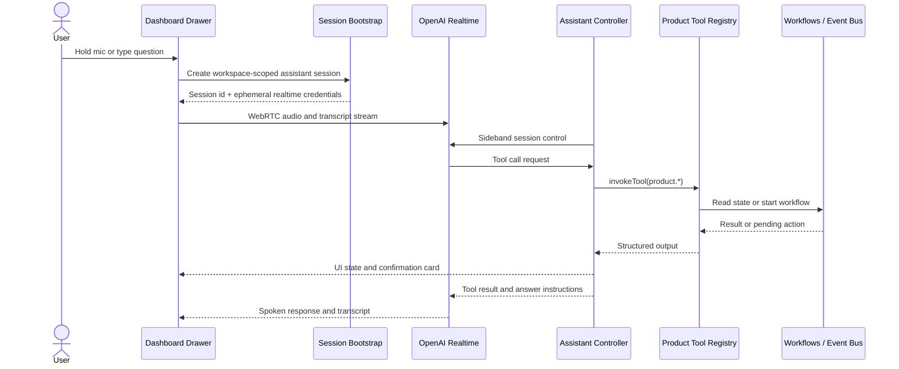

# Bombsell Voice Agent Drawer Plan

## Summary

Build a global right-drawer `Talk to Agent` surface that lives across Brief,
Agent, and Profile. Users should be able to hold to talk, keep chatting by
voice or text, hear spoken answers, and inspect source-backed cards that route
back into the existing Bombsell surfaces.

The assistant should be a thin orchestration layer over the current
`product.*` tool surface and durable workflow paths, not a fourth dashboard tab
and not a parallel backend. V1 should be read-first, fast, and trustworthy:
deep workspace answers, clear next actions, and explicit confirmation before
any state-changing action runs.

---

## Problem Frame

Bombsell already has most of the hard backend substrate needed for a useful
operator assistant: a product tool registry, prompt-ready workspace context,
launch-readiness checks, conversation proof traces, company-brain recall, and
durable workflows for the core GTM loop. What the product does not yet have is
the operator-facing conversational layer that lets a user ask those questions
without clicking through three surfaces.

The current repo also changes the framing from older architecture prose. The
active product is the three-surface prospecting and outbound wedge
(`Brief`, `Agent`, `Profile`), while some "current Bombsell" sections in
`ARCHITECTURE.md` are stale. The plan should therefore anchor to the current
codebase and its live product seams, while still honoring the architecture's
core rules: no bypassing typed tools and workflow paths, no new top-level
surface, no hidden send path, and no new user-facing primitive.

This request is also distinct from the architecture's future `voice` channel.
`core/channels/voice/` is still a placeholder, and that channel is about
prospect-facing voice execution. The feature here is an operator assistant for
workspace data and account state. V1 should not depend on implementing outbound
or inbound prospect voice.

---

## Research Snapshot

Last checked: 2026-06-20.

### Local Product Grounding

- `components/dashboard/Shell.tsx` keeps the product to three primary surfaces
  and is the right place for a route-stable global drawer trigger.
- `app/globals.css` already ships reusable `.drawer-panel` transitions for a
  right-side drawer.
- `app/dashboard/profile/ProfilePage.tsx` already contains a working drawer
  pattern that can be reused for interaction structure and motion.
- `docs/agent-native-capability-map.md` requires every user-visible action to
  map back to a same-workspace tool and runtime path.
- `docs/gojiberry-competitive-audit-2026-06-18.md` explicitly says to turn
  AI-chat into status-derived next moves inside Brief and Agent rather than
  adding another assistant tab.
- `core/product/tools.ts` already exposes the read surface the assistant needs:
  `product.brief.get`, `product.context.get`, `product.state.get`,
  `product.qualified_signals.list`, `product.company_brain.recall`,
  `product.launch.readiness.get`, `product.conversation.trust.get`,
  `product.meeting.prep.generate`, `product.approval.decide`, and related
  refresh and recovery tools.

### External Guidance

- OpenAI's Voice Agents guide recommends creating the client secret on the app
  server, connecting the browser with a Realtime session, and keeping business
  logic in the server-side agent layer rather than the transport layer.
  Source: [OpenAI Voice Agents](https://developers.openai.com/api/docs/guides/voice-agents)
- OpenAI's Realtime WebRTC guide recommends WebRTC over raw WebSockets for
  browser speech-to-speech use cases because it is the low-latency browser
  transport path.
  Source: [OpenAI Realtime WebRTC](https://developers.openai.com/api/docs/guides/realtime-webrtc)
- OpenAI's Realtime server-controls and MCP guides recommend a server-side
  sideband connection for tool calls, session control, and business logic.
  Source: [OpenAI Realtime Server Controls](https://developers.openai.com/api/docs/guides/realtime-server-controls),
  [OpenAI Realtime MCP](https://developers.openai.com/api/docs/guides/realtime-mcp)
- OpenAI's Realtime prompting guidance recommends `gpt-realtime-2`, low
  reasoning effort, and explicit confirmation boundaries before write actions.
  Source: [OpenAI Realtime Models Prompting](https://developers.openai.com/api/docs/guides/realtime-models-prompting)
- MDN's browser docs confirm that `getUserMedia()` needs a secure context and
  explicit mic permission, that Web Audio playback is gesture-sensitive, and
  that `MediaRecorder` is a viable fallback for chunked push-to-talk capture.
  Source: [MDN getUserMedia](https://developer.mozilla.org/en-US/docs/Web/API/MediaDevices/getUserMedia),
  [MDN Web Audio API](https://developer.mozilla.org/en-US/docs/Web/API/Web_Audio_API),
  [MDN MediaRecorder](https://developer.mozilla.org/en-US/docs/Web/API/MediaRecorder)

---

## Requirements

### Experience

- R1. The assistant must open as a right-side drawer from any `/dashboard`
  surface without adding a fourth primary tab or changing the Brief / Agent /
  Profile product model.
- R2. The primary input must be simple push-and-hold voice capture with mouse,
  touch, and keyboard parity, plus a text input fallback in the same drawer.
- R3. The drawer must show live session state for listening, thinking,
  speaking, and transcript progress, and let the user interrupt, cancel, or
  continue the same session without losing the visible thread.

### Capability Coverage

- R4. The assistant must answer quantitative workspace questions about
  qualified signals, outreach volume, replies, meetings, review queue,
  readiness, and recent activity using current Bombsell data.
- R5. The assistant must answer qualitative questions such as "why did this
  happen", "what changed", "what should I do next", and "what is blocking
  launch" with source-backed summaries rather than generic assistant filler.
- R6. The assistant must answer account and setup questions about company
  profile, buyer fit, connected Outlook and LinkedIn accounts, approvals,
  limits, and channel readiness from the active workspace state.
- R7. Answers that reference a concrete thread, signal, or blocker must include
  actionable deep links back into Brief, Agent, Profile, or outreach proof.

### Trust And Safety

- R8. State-changing actions from the drawer must flow through existing
  `product.*` write tools and require explicit confirmation before any
  approval, dispatch, configuration, or channel-side effect runs.
- R9. The assistant must never bypass Bombsell's existing approval gates,
  hot-path eval gates, channel readiness checks, or durable workflow paths.

### Architecture And Operations

- R10. The assistant runtime must use the tool registry and evented workflow
  surfaces for business behavior rather than adding direct domain-specific SQL
  shortcuts for reads or writes.
- R11. Voice transport must remain browser-safe and low-latency: authenticated
  session bootstrap, clear mic-permission states, autoplay-safe response audio,
  and a graceful text-only fallback when voice transport is unavailable.
- R12. Assistant session telemetry must be workspace-scoped and auditable, with
  raw audio excluded from default persistence.
- R13. The launch PR must update `docs/agent-native-capability-map.md` and add
  automated coverage for drawer UI state, auth, tool policy, and confirmation
  behavior.

---

## Acceptance Examples

- AE1. A user holds the mic button and asks, "How many qualified signals did we
  get last week?" The assistant answers from `product.brief.get`, speaks the
  topline numbers, and shows a card that deep-links into `/dashboard/agent`.
- AE2. A user asks, "Why is email still blocked?" The assistant answers from
  `product.launch.readiness.get`, names the blockers in plain language, and
  links directly into the relevant Profile section.
- AE3. A user asks, "Approve the top draft." The assistant does not run
  `product.approval.decide` immediately. It creates a visible confirmation card
  that summarizes the action and only executes after the user confirms.
- AE4. A user denies microphone permission. The drawer stays useful: transcript
  history remains visible, the text composer stays active, and the assistant can
  still answer from the same workspace tool surface.

---

## Key Technical Decisions

- KTD1. Ship the feature as a global `Talk to Agent` drawer mounted from
  `components/dashboard/Shell.tsx`, not as a new `/dashboard/assistant` route
  or a fourth nav tab.
  This preserves the three-surface model that the current product and recent
  audits already reinforced.

- KTD2. Use browser WebRTC against OpenAI Realtime for audio transport, but
  keep the UX manual push-to-talk in V1 instead of VAD-first hands-free mode.
  WebRTC gives the low latency and interruption quality we want, while manual
  hold-and-release boundaries keep the interaction simple and reduce accidental
  captures or premature tool calls.

- KTD3. Keep business logic on the server side through an authenticated
  assistant controller that owns instructions, tool exposure, confirmation
  policy, and tool execution.
  The browser should handle media and rendering, not workspace business rules
  or privileged product writes.

- KTD4. Expose a curated allowlist of existing `product.*` tools to the voice
  runtime instead of the full registry.
  The first read should usually be `product.brief.get`; deeper follow-ups should
  use targeted tools such as `product.launch.readiness.get`,
  `product.qualified_signals.list`, `product.company_brain.recall`, and
  `product.conversation.trust.get`. Broad tools such as `product.state.get` and
  `product.context.get` stay available for deeper investigations, not as the
  default for every turn.

- KTD5. Treat the drawer as an operator surface over existing primitives, not
  as a `Conversation` primitive.
  Assistant turns should not be written into `conversations`, and V1 should not
  depend on `core/channels/voice/`. That channel remains a separate future
  project for prospect-facing voice execution.

- KTD6. Default write scope must be narrow.
  Low-risk derived actions such as `product.meeting.prep.generate` and selected
  refresh flows can run directly. Approval decisions, dispatch, CRM handoff,
  retry, and configuration changes must create a visible confirmation step
  first. Direct send or outbound voice execution stays out of scope.

- KTD7. Present results as multimodal answer cards rather than raw tool JSON.
  Each answer should include a spoken summary, transcript text, important
  numbers or blockers, and deep links into the canonical Bombsell surface that
  owns the proof.

---

## High-Level Technical Design

### Assistant Capability Surface

| Ask Shape | Primary Tool Path | Expected Drawer Output |
|---|---|---|
| Operating brief, counts, and trends | `product.brief.get` | Spoken summary, metrics card, next-action link |
| Qualified signals and outreach readiness | `product.qualified_signals.list`, optional `product.contact.waterfall.resolve` | Ranked signal cards with channel readiness and Agent links |
| Launch blockers and account readiness | `product.launch.readiness.get` | Plain-language blocker list and Profile deep links |
| Workspace memory and qualitative context | `product.company_brain.recall`, `product.context.get`, `product.state.get` | Narrative answer with source-backed cards |
| Exact thread proof or meeting context | `product.conversation.trust.get`, `product.meeting.prep.generate` | Thread summary, trust trace, meeting-prep card |
| Safe writes | Curated `product.*` write allowlist | Pending-action card or completed artifact |

### Controller Responsibilities

1. Authenticate the active workspace and create the assistant session.
2. Attach the curated tool surface and task instructions to the realtime
   session.
3. Decide whether a requested action is read-only, low-risk derived work, or a
   confirmation-gated write.
4. Convert tool results into drawer cards with canonical Bombsell links.
5. Emit workspace-scoped assistant telemetry without persisting raw audio.

---

## Scope Boundaries

### Deferred For Later

- Hands-free continuous mode, wake words, or VAD-first conversation flow.
- Prospect-facing voice channel work in `core/channels/voice/`.
- Voice-driven broad Profile editing and source reconfiguration beyond the
  curated V1 action set.
- Calendar booking and scheduling actions beyond meeting-prep generation.
- Native mobile packaging beyond a responsive dashboard drawer.

### Outside This Product's Identity

- A generic web assistant that browses arbitrary external content for the user.
- Silent sending or approval bypass from a conversational surface.
- A new top-level assistant tab or a parallel "chat product" distinct from
  Brief, Agent, and Profile.

---

## System-Wide Impact

- The dashboard shell becomes the global host for a persistent operator
  interaction surface. That is a product-surface change and should be treated
  with the same surface-contract discipline as Brief, Agent, and Profile.
- The assistant becomes another consumer of the existing tool registry and
  durable workflow runtime, which is good architecture pressure: if a workflow
  or read path is not toolized cleanly, the drawer should expose that gap
  rather than patching around it with a custom route.
- Trust surfaces become more important, not less. A conversational answer
  should route the user into the same proof pages the product already owns,
  especially launch blockers and outreach trace.
- Because this is a user-visible action, `docs/agent-native-capability-map.md`
  and the related surface-contract tests should grow with the feature.

---

## Risks And Dependencies

- **Realtime controller hosting:** a long-lived sideband session may not belong
  inside the web deployment tier if that tier is short-lived or request-bound.
  If so, the controller should live on the existing worker/runtime tier while
  the dashboard still owns session bootstrap and UI state.
- **Tool latency and payload size:** broad workspace reads can become slow or
  noisy in voice turns. Mitigation: `product.brief.get` first, targeted reads
  second, and presenter-layer summaries instead of raw payload dumping.
- **Mic permission and autoplay constraints:** browser voice flows can fail for
  reasons unrelated to product logic. Mitigation: user-gesture-driven connect,
  obvious permission states, and same-drawer text fallback.
- **Write-action misfires:** voice transcription can mishear high-impact
  commands. Mitigation: confirmation-gated write policy plus existing Bombsell
  approval and channel rails.
- **Privacy expectations:** storing raw audio would increase both risk and
  operational weight. Mitigation: persist session metadata, tool traces, and
  optionally redacted transcripts, but keep raw audio out of default storage.

---

## Implementation Units

### U1. Global Drawer Shell And Push-To-Talk UX

- **Goal:** Add a route-stable drawer trigger and interaction shell to
  `components/dashboard/Shell.tsx`, with push-to-talk, text fallback, live
  transcript, response cards, and mobile-safe layout behavior.
- **Files:** `components/dashboard/Shell.tsx`,
  `components/dashboard/VoiceAgentLauncher.tsx`,
  `components/dashboard/VoiceAgentDrawer.tsx`, `app/globals.css`.
- **Patterns:** `app/dashboard/profile/ProfilePage.tsx` drawer behavior and the
  existing `.drawer-panel` transitions in `app/globals.css`.
- **Test scenarios:** open and close from Brief, Agent, and Profile; hold and
  release by mouse, touch, and keyboard; retain visible session state while
  navigating within `/dashboard`; degrade cleanly when mic permission is
  blocked.

### U2. Authenticated Realtime Session Bootstrap

- **Goal:** Create a workspace-scoped assistant session route that authenticates
  the user, configures the realtime session, and returns ephemeral credentials
  plus a server-side session id.
- **Files:** `app/api/assistant/session/route.ts`,
  `core/product/assistant/session.ts`, `core/product/assistant/config.ts`,
  `test/assistant-session-route.test.ts`.
- **Patterns:** `app/api/mcp/route.ts` for auth and workspace scoping,
  `core/mcp/instructions.ts` for the current product entry guidance.
- **Test scenarios:** reject unauthenticated requests; reject cross-workspace
  session reuse; return the curated tool/instruction set; default to manual
  push-to-talk turn handling.

### U3. Server-Side Assistant Controller And UI State Stream

- **Goal:** Keep tool execution, confirmation policy, and session orchestration
  on the server side while streaming assistant state back to the drawer.
- **Files:** `core/product/assistant/controller.ts`,
  `core/product/assistant/events.ts`, `app/api/assistant/events/route.ts`,
  `scripts/production-worker.ts` or `scripts/managed-worker.ts`,
  `test/assistant-controller.test.ts`.
- **Patterns:** `core/agents/tools/registry.ts`, `core/substrate/events/index.ts`,
  `core/product/health.ts`.
- **Test scenarios:** tool call round-trip; cancel and interrupt mid-response;
  reconnection after a transient transport drop; confirmation request emission
  and resolution.

### U4. Curated Tool Surface, Presenters, And Confirmation Policy

- **Goal:** Define which existing `product.*` tools the assistant may use, how
  they are presented in the drawer, and which actions require confirmation.
- **Files:** `core/product/assistant/tool-surface.ts`,
  `core/product/assistant/policy.ts`, `core/product/assistant/presenters.ts`,
  `core/product/assistant/deep-links.ts`,
  `test/product-assistant-tool-surface.test.ts`.
- **Patterns:** `core/product/tools.ts`, `core/product/conversation-trust.ts`,
  `docs/agent-native-capability-map.md`.
- **Test scenarios:** quantitative asks route to `product.brief.get` or a
  targeted read tool; qualitative asks return launch blockers, memory, or proof
  with deep links; low-risk derived actions can complete; approval, dispatch,
  retry, and configuration actions pause for confirmation.

### U5. Observability, Docs, And Launch Verification

- **Goal:** Make the feature auditable, keep product docs aligned, and add a
  repeatable verification path before wider rollout.
- **Files:** `docs/agent-native-capability-map.md`,
  `test/product-surface-contract.test.ts`, `test/product-tools.test.ts`,
  `test/voice-agent-events.test.ts`, `scripts/verify-dashboard-surfaces.ts`,
  optional `scripts/verify-voice-agent.ts`.
- **Patterns:** existing capability-map enforcement and dashboard-surface
  verification scripts.
- **Test scenarios:** capability-map row matches the live tool/runtime surface;
  assistant events stay workspace-scoped and exclude raw audio; the feature does
  not reintroduce a fourth primary surface; the text-only fallback path stays
  usable when audio is unavailable.

---

## Documentation And Operational Notes

- Roll out behind a feature flag or allowlist first. This is the right place to
  dogfood confirmation policy, latency, and privacy posture before exposing the
  drawer widely.
- Reuse `OPENAI_API_KEY` only if the deployment posture and key ownership are
  acceptable for realtime sessions. If not, introduce assistant-specific env
  config deliberately rather than piggybacking on the embeddings path by
  accident.
- Update internal docs to distinguish two different meanings of "voice":
  operator voice assistant now, prospect-facing voice channel later.

---

## Sources

### Repo Sources

- `ARCHITECTURE.md`
- `components/dashboard/Shell.tsx`
- `app/globals.css`
- `app/dashboard/profile/ProfilePage.tsx`
- `core/agents/tools/registry.ts`
- `core/product/tools.ts`
- `core/product/context.ts`
- `core/primitives/conversation.ts`
- `docs/agent-native-capability-map.md`
- `docs/gojiberry-competitive-audit-2026-06-18.md`

### External Sources

- [OpenAI Voice Agents](https://developers.openai.com/api/docs/guides/voice-agents)
- [OpenAI Realtime WebRTC](https://developers.openai.com/api/docs/guides/realtime-webrtc)
- [OpenAI Realtime MCP](https://developers.openai.com/api/docs/guides/realtime-mcp)
- [OpenAI Realtime Server Controls](https://developers.openai.com/api/docs/guides/realtime-server-controls)
- [OpenAI Realtime Models Prompting](https://developers.openai.com/api/docs/guides/realtime-models-prompting)
- [MDN getUserMedia](https://developer.mozilla.org/en-US/docs/Web/API/MediaDevices/getUserMedia)
- [MDN Web Audio API](https://developer.mozilla.org/en-US/docs/Web/API/Web_Audio_API)
- [MDN MediaRecorder](https://developer.mozilla.org/en-US/docs/Web/API/MediaRecorder)
